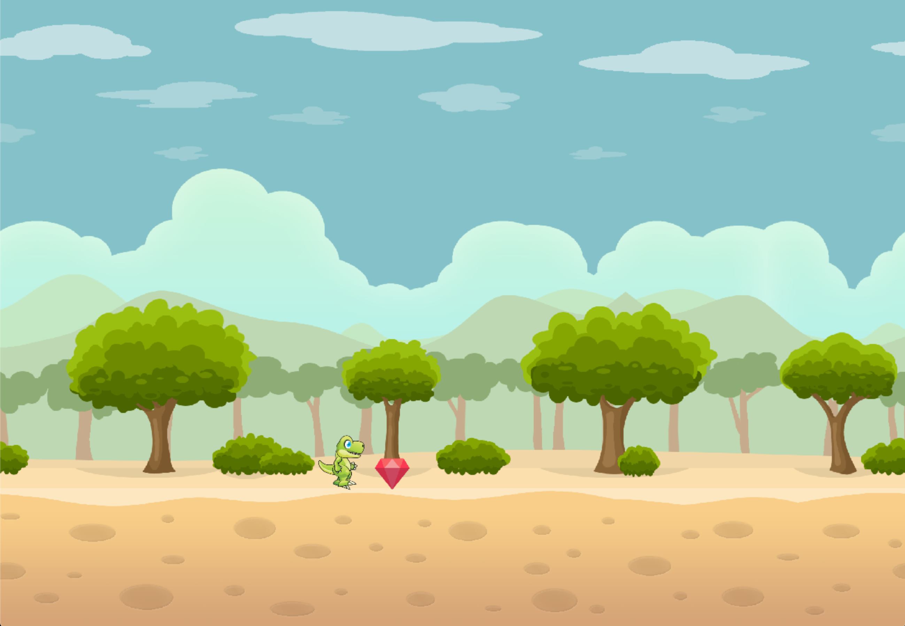
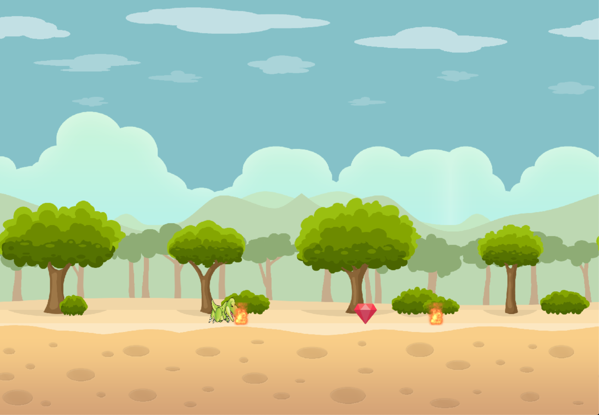

# Dino Diamond Game (UDACITY CPP CAPSTONE PROJECT)

This is my capstone submission for the c++ nanodegree. The goal is to try beat your previous score with every attempt. Your score will be saved after each game and you can see your previous score in the top of the window.




In this game, you will play as a small dinosaur who needs to eat some diamonds and will get a point for each diamond that you eat. Just make sure to avoid the fire...

## Project structure
### `Player`
The player, is encapsulated in the `player.h` and `player.cpp` files. Both the logic relating to updating and rendering for tyhids class sits inside of these files.

### `Challenges`
The diamonds and the fires are referred to as challenges in this code base and share the same class as they behave the same way internally with one key difference. One will add a point and another will kill the player. The both pose a challebnge to the user. Therefore the diamonds and fires that you see on the screen can be found in `challenge.h` and `challenge.cpp` respectively.

### `Collision Detection`
Collision detection is owned by a coliision class as it takes the responsibility and concern of collision by itself and provides a layer of abstraction by consuming the prayer and challenges on every update life cycle and check for any collisions between the player and any of the challenges;

### `Parallax`
Parallax is the class that provdes some abstraction to having a background that moves as the player moves. They can move at a given speed and therefore the developer can easily control which one will move quickly or slowly based on the z distance to the player.

## Rubric points

### `Compiling and Testing (All Rubric Points REQUIRED)`
```
`The submission must compile and run.` - README (follow build instuctions below using `cmake` and `make`)
```

### `Loops, Functions, I/O`
```
`The project demonstrates an understanding of C++ functions and control structures.` - Player.cpp && Challenge.cpp && Parallax.cpp

`The project reads data from a file and process the data, or the program writes data to a file.` - main.cpp

`The project accepts user input and processes the input.` - controller.cpp && game.cpp:41
```

### `Object Oriented Programming`
```
`The project uses Object Oriented Programming techniques.` - all files except main.cpp

`Classes use appropriate access specifiers for class members.` - all files except main.cpp

`Class constructors utilize member initialization lists` - game.cpp:8-20

`Classes abstract implementation details from their interfaces.` - parallax.cpp && player.cpp && challenge.cpp

`Classes encapsulate behavior.` -

`Classes follow an appropriate inheritance hierarchy.` -

`Overloaded functions allow the same function to operate on different parameters.` - challenge.h:14 && challenge.h:25

`Derived class functions override virtual base class functions.` -

`Templates generalize functions in the project.` -
```

### `Memory Management`
```
`The project makes use of references in function declarations.`

`The project uses destructors appropriately.`

`The project uses scope / Resource Acquisition Is Initialization (RAII) where appropriate.`

`The project follows the Rule of 5.`

`The project uses move semantics to move data, instead of copying it, where possible.`

`The project uses smart pointers instead of raw pointers.`
```

### `Concurrency`
```
`The project uses multithreading.`

`A promise and future is used in the project.`

`A mutex or lock is used in the project.`

`A condition variable is used in the project.`
```


## Dependencies for Running Locally
* cmake >= 3.7
  * All OSes: [click here for installation instructions](https://cmake.org/install/)
* make >= 4.1 (Linux, Mac), 3.81 (Windows)
  * Linux: make is installed by default on most Linux distros
  * Mac: [install Xcode command line tools to get make](https://developer.apple.com/xcode/features/)
  * Windows: [Click here for installation instructions](http://gnuwin32.sourceforge.net/packages/make.htm)
* SDL2 >= 2.0
  * All installation instructions can be found [here](https://wiki.libsdl.org/Installation)
  * Note that for Linux, an `apt` or `apt-get` installation is preferred to building from source.
* SDL2 Image
* SDL2 Mixer
* gcc/g++ >= 5.4
  * Linux: gcc / g++ is installed by default on most Linux distros
  * Mac: same deal as make - [install Xcode command line tools](https://developer.apple.com/xcode/features/)
  * Windows: recommend using [MinGW](http://www.mingw.org/)

## Basic Build Instructions
### Before attemptiung to install please be sure tyo have SDL mixer and audio isntalled
1. Clone this repo.
2. Make a build directory in the top level directory: `mkdir build && cd build`
3. Compile: `cmake .. && make`
4. Run it: `./SnakeGame`.
